# cp_reference

## 1 cp基本语法

### 1.1 标识符

- 第一个字符必须是字母表中字母或下划线 **_** 。
- 标识符的其他的部分由字母、数字和下划线组成。
- 标识符对大小写敏感。

### 1.2 变量

本语言中有以下三种变量：

- 全局变量
- 局部变量
- 成员变量

### 1.3 保留字

**基本类型：** int（整数）、float（浮点数）、bool（布尔）、string（字符串、字符）

**程序控制语句**：break（跳出循环）、continue（继续）、do（运行）、else（否则）、for（循环）、if（如果）、return（返回）、while（循环）

**变量引用**：super（父类）、this（本类）

**类**：class（声明类）、extends（继承）、new（创建）

**函数**：func（命名函数）

**IO**：print（输出）、cin（输入）

### 1.4 注释

注释会被忽略。

目前仅支持单行注释。

```
!! 注释内容
print("hello world!")
```

### 1.5 输出

输出格式为

```
print(表达式 [, 表达式, ... , 表达式], [sep=表达式], [end=表达式])
```

**sep** 和 **end** 分别是输出间隔符和输出结束符，默认为空格和换行符。

以下是一个简单的 $cp$ 程序。

```cp
print("Hello, world!", "This is my first program!", sep=" ", end="")
```

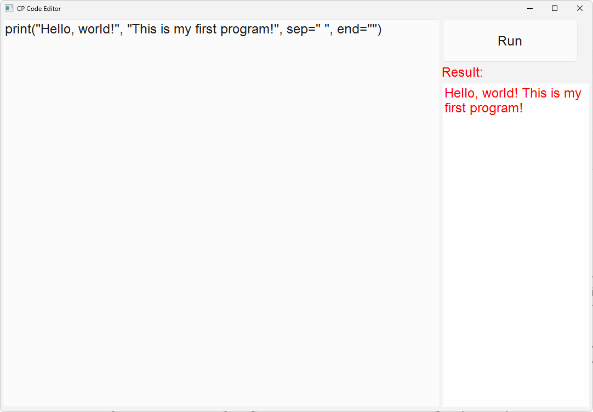

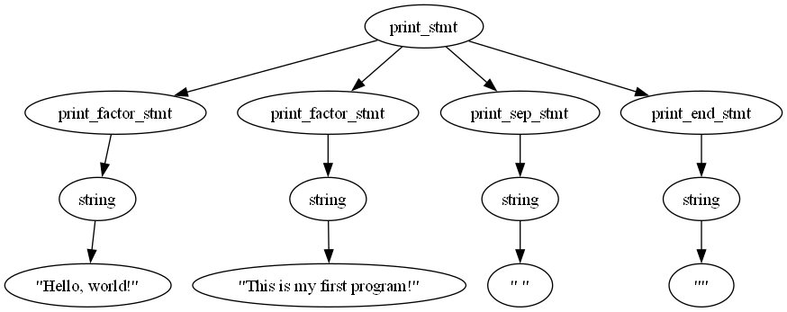

### 1.6 输出

输入的格式如下：

```
cin >> 变量1 [>> 变量2 ...]
```

给出一例子如下：

```
int x = 1
cin >> x
print(x)
```

**目前仅支持命令行输入值。**


## 2 数据类型

### 2.1 基本数据类型
$cp$ 提供了 $4$ 种基本数据类型，见下表。

| 数据类型 | 关键字 |
| :------: | ---- |
|   int   | 整数 |
|  float  | 浮点数 |
|  bool   | 布尔值 |
|  string | 字符串 |

### 2.2 变量声明

变量声明格式为
```
基本数据类型 变量名 [= 初始值] [, 变量名2 [= 初始值], ... , 变量名n [= 初始值]]
```

如果没有初始值，则变量默认为0，如果是字符串默认为空串。

```cp
int a = 1, e = 2
float b
string c = "hello world"
bool d = True
print("a =", a)
print("b =", b)
print("c =", c)
print("d =", d)
print("e =", e)
```

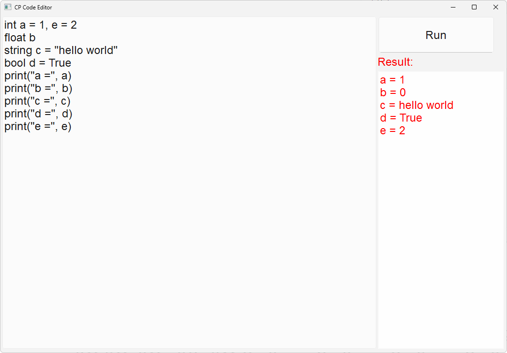


## 3 运算符

$cp$ 提供以下 $4$ 种类型的运算符：
- 算术运算符
- 比较运算符
- 赋值运算符
- 逻辑运算符

接下来，我将一一展示。

### 3.1 算术运算符

| 运算符 | 描述 |
| :------: | ---- |
|   +   | 加 - 两个对象相加 |
|  -  | 减 - 得到负数或是一个数减去另一个数 |
|  *   | 乘 - 两个数相乘或是返回一个被重复若干次的字符串 |
|  / | 除 - x除以y |
|  % | 取模 - 返回除法的余数 |
|  ** | 幂 - 返回x的y次幂 |
|  // | 取整除 - 返回商的整数部分（向下取整） |
| ++ | 自增运算符，整数值增加 1 |
| -- | 自减运算符，整数值减少 1 |

```cp
int a = 8
int b = 2
print("a + b =", a+b)
print("a - b =", a-b)
print("a * b =", a*b)
print("a / b =", a/b)
print("a % b =", a%b)
print("a ** b =", a**b)
print("a // b =", a//b)
a ++
b --
print("a ++ =", a)
print("-- b =", b)
```


### 3.2 比较运算符

| 运算符 | 描述 |
| :------: | ---- |
|   ==   | 等于 - 比较对象是否相等 |
|  !=  | 不等于 - 比较两个对象是否不相等 |
|  >  | 大于 - 返回x是否大于y |
|  < | 小于 - 返回x是否小于y。所有比较运算符返回1表示真，返回0表示假。这分别与特殊的变量 True 和 False 等价。 |
|  >= | 大于等于 - 返回x是否大于等于y。 |
|  <= | 小于等于 - 返回x是否小于等于y。 |

```cp
print("1 == 2 =", 1==2)
print("1 != 2 =", 1!=2)
print("1 > 2 =", 1>2)
print("1 < 2 =", 1<2)
print("1 >= 2 =", 1>=2)
print("1 <= 2 =", 1<=2)
```

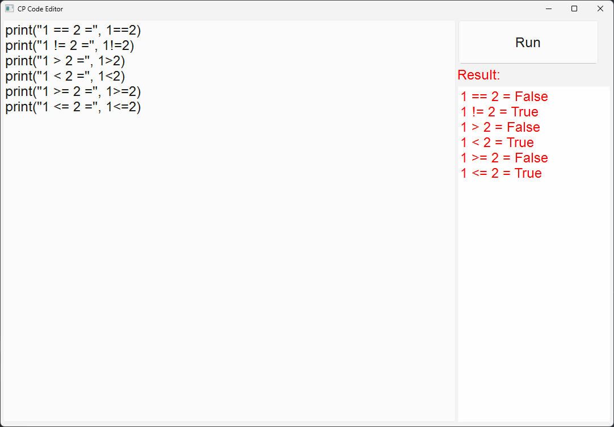


### 3.3 赋值运算符

| 运算符 | 描述 |
| :------: | ---- |
|=	 |简单的赋值运算符|
|+=	|加法赋值运算符|
|-=	|减法赋值运算符|
|*=	|乘法赋值运算符|
|/=	|除法赋值运算符|
|%=	|取模赋值运算符|
|**=	|幂赋值运算符|
|//=	|取整除赋值运算符|
|<<=	|左移赋值运算符|
|>>=	|右移赋值运算符|
|\|=	|或赋值运算符|
|&=	|与赋值运算符|
|^=	|异或赋值运算符|

```cp
int a = 1, b = 2
a += b
print("a += b =", a)
a -= b
print("a -= b =", a)
a *= b
print("a *= b =", a)
a /= b
print("a /= b =", a)
a %= b
print("a %= b =", a)
a **= b
print("a **= b =", a)
a //= b
print("a //= b =", a)
int c = 2
c <<= 1
print("c <<= 1 =", c)
c >>= 1
print("c >>= 1 =", c)
c |= 2
print("c |= 2 =", c)
c &= 1
print("c &= 1 =", c)
c ^= 1
print("c ^= 1 =", c)
```


### 3.4 逻辑运算符

| 运算符 | 描述 |
| :------: | ---- |
|&	 |与|
|\|	|或|
|^	|异或|
|~	|取反|
|!  |非|
| >> | 右移 |
| << | 左移 |

```cp
print("1 & 3 =", 1 & 3)
print("1 | 2 =", 1 | 2)
print("1 ^ 3 =", 1 ^ 3)
print("~1 =", ~1)
print("!1 =", !1)
print("1 << 2 =", 1 << 2)
print("5 >> 2 =", 5 >> 2)
```


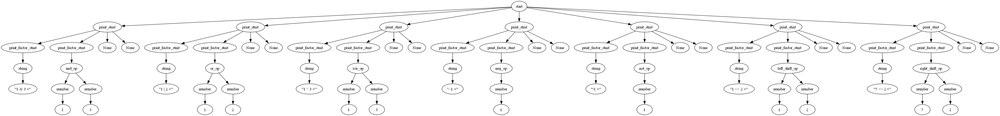

## 4 条件控制

条件控制语句格式为：

```cp
if (condition) {
  statement
}
[elif (condition) {
  statement
}]
[elif (condition) {
  statement
}]
[...]
[else {
  statement
}]
```

现有一例子如下：

```cp
int a = 10, b = 5
if(a < b) {
  print("a < b")
} elif(a == b) {
  print("a == b")
} else {
  print("a > b")
}
int c = 5, d = 5
if(c < d) {
  print("c < d")
} elif(c == d) {
  print("c == d")
} else {
  print("c > d")
}
int e = 5, f = 10
if(e < f) {
  print("e < f")
} elif(e == f) {
  print("e == f")
} else {
  print("e > f")
}
```


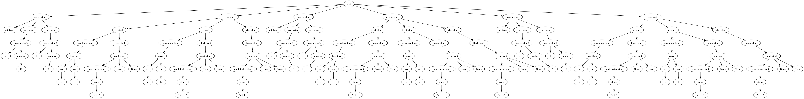)

## 5 循环控制

### 5.1 for 循环

for 循环格式为：
```cp
for ([statement]; [condition]; [statement]) {
  statement
}
```

现有一例子如下：

```cp
for (int i = 0; i < 3; i++) {
  print("i =", i)
}

for (int j = 0; j < 3;) {
  print("j =", j)
  j ++
}

int k = 0

for (; k < 3;) {
  print("k =", k)
  k ++
}
```

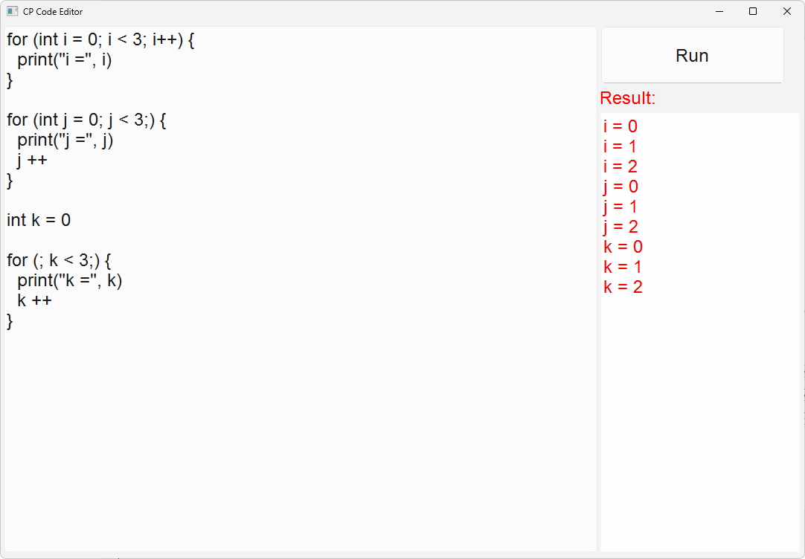

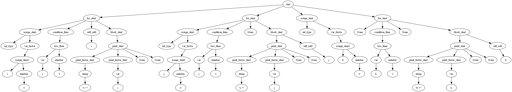

### 5.2 while 循环
while 循环格式为：
```cp
while (condition) {
  [statement]
}
```

现有一例子如下：
```cp
int i = 0
while (i < 3) {
  print("i =", i)
  i ++
}
```

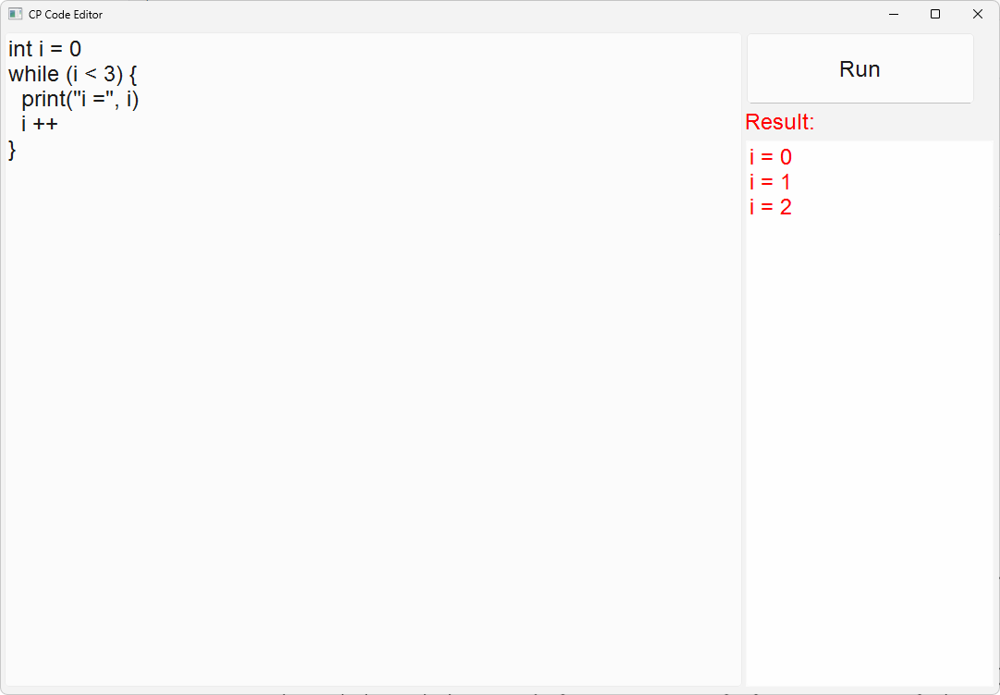


### 5.3 do-while 循环

do-while 循环格式为：
```cp
do {
  [statement]
} while (condition)
```

现有一例子如下：
```cp
int i = 0
do {
  print("i =", i)
  i ++
} while (i < 3)
```


### 5.4 continue 语句

continue 语句格式为：

```cp
for(statement; condition; statement) {
  [statement]
  continue
  [statement]
}
```

现有一例子如下：

```cp
for(int i = 0; i < 3; i ++) {
  print("before continue")
  continue 
  print("after continue")
}
```


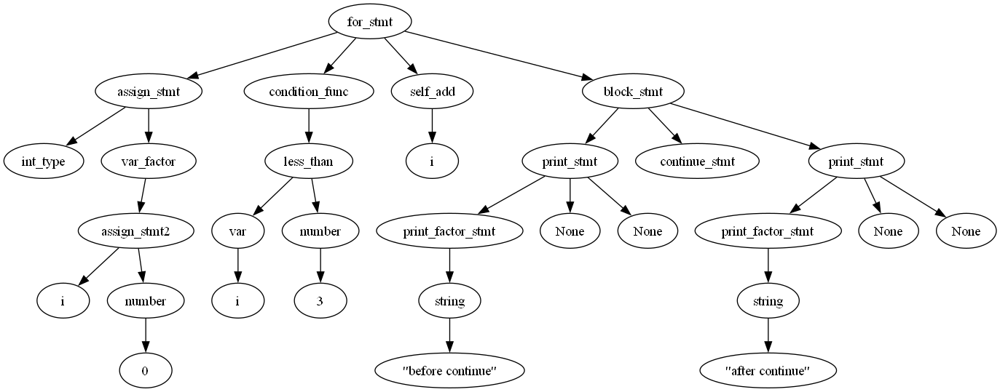

### 5.5 break 语句

break 语句格式为：
```cp
for(statement; condition; statement) {
  [statement]
  break
  [statement]
}
```

现有一例子如下：

```cp
for(int i = 0; ; i ++) {
  print(i)
  if(i == 3) {
    break
  }
}
```


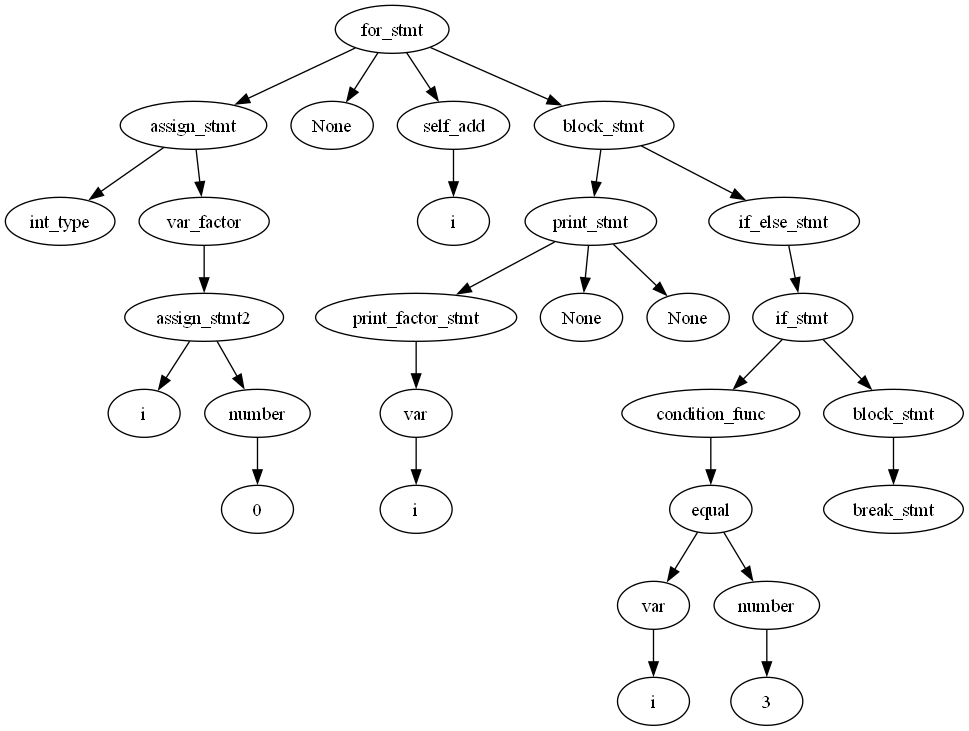

## 6 函数

### 6.1 定义函数

定义函数的格式如下：

```
func func_name([arg_list]) {
	[statement]
}
```

函数不需要设置返回类型，程序会自动判断返回类型。

**注意**：如果没有返回值，而要输出函数返回值，会报错。

给出一个函数定义的例子，计算两数之和：

```
func add(int a, int b) {
	return a + b
}
```


###  6.2 调用函数

当程序调用函数时，程序控制权会移动到被调用函数。

调用方式如下：

```
func_name([arg_list])
```

给出一个例子：

```
func add(int a, int b) {
	return a + b
}
print(add(1, 2))
```

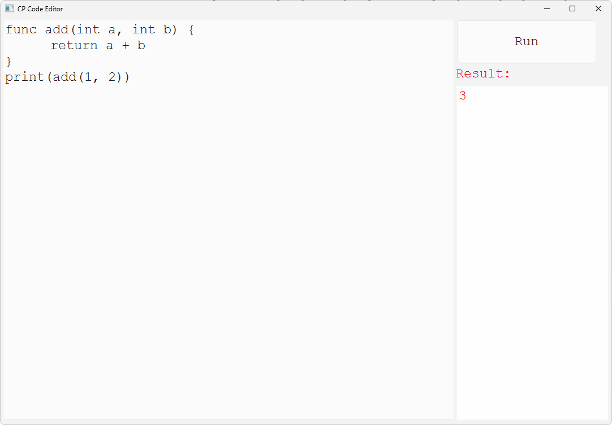


再给出一个求斐波那契数列的例子

```
func fib(int x) {
	if (x <= 2) {
		return 1
	}
	return fib(x - 1) + fib(x - 2)
}
print(fib(3))
print(fib(4))
print(fib(5))
print(fib(6))
```

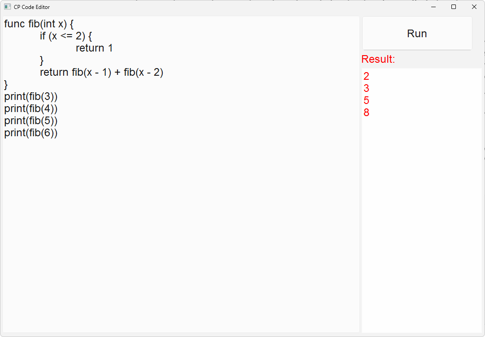


## 7 面向对象

### 7.1 类的定义

类的定义格式如下：

```
class class_name {
	[type var_name [= value]]
	[func func_name([arg_list]) { statement }]
}
```

**注意**：本语言暂时未设计访问修饰符，权限等同于 `public`。

给出一个例子：

```
class A {
	int a = 2
	func add(int x, int y) {
		return x + y
	}
}
```


### 7.2 定义对象

对象的定义格式如下：

```
class_name instance_name = new class_name()
```

给出一个例子：

```
class A {
	int a = 2
	func add(int x, int y) {
		return x + y
	}
}
A a = new A()
```


### 7.3 访问对象成员

类的对象的属性和方法可以使用直接访问符`.`来访问。

**注意：**暂时未定义构造方法。

```
class class_name {
	[type var_name [= value]]
	[func func_name([arg_list]) { statement }]
}
class_name instance_name = new class_name()
instance_name.var_name
instance_name.func_name([arg_list])
```

例如：

```
class A {
	int a = 2
	func add(int x, int y) {
		return x + y
	}
}
A a = new A()
print(a.a)
print(a.add(1, 2))
```


### 7.4 类的继承

我们可以使用`extends`关键字申明一个类是从另外一个类继承而来的，格式如下：

```
class 父类 {

}
class 子类 extends 父类 {

}
```

子类可以继承父亲的属性和方法。

给一例子：

```
class A {
	int a = 100
}
class B extends A {
	int b
}
class C extends B {
	int c
}
C c = new C()
print(c.a)
```


### 7.5 super与this关键字

**super关键字**：我们可以通过super关键字实现对父类成员的访问，用来引用当前对象的父类。

**this关键字**：指向自己的引用，引用当前对象，即它所在的方法所属的对象实例。

给出一例子：

```
class Animal {
	func eat() {
		print("animal : eat")
	}
}
class Dog extends Animal {
	func eat() {
		print("dog : eat")
	}
	func eatTest() {
		this.eat()
		super.eat()
	}
}
Animal a = new Animal()
a.eat()
Dog d = new Dog()
d.eatTest()
```


### 7.6 重写

子类定义了一个与其父类具有相同名称和参数列表的方法，并且子类的实现覆盖了父类的实现。

给出一个例子：

```
class Animal {
	func move() {
		print("The animal is moving.")
	}
}
class Dog extends Animal {
	func move() {
		print("The dog is moving.")
	}
}
Animal a = new Animal()
Dog d = new Dog()
a.move()
d.move()
```


#### super关键字在重写中的使用

当需要在子类中调用父类的被重写方法时，要使用 super 关键字。

```cpp
class Animal{
   func move(){
      print("The animal is moving.")
   }
}
 
class Dog extends Animal{
   func move(){
      super.move()
      print("The dog is moving.")
   }
}

Dog d = new Dog()
d.move()
```


### 7.7 重载

重载是在一个类里面，方法名字相同，而参数不同。返回类型可以相同也可以不同。

```
class Overloading {
    func test(){
        print("test1")
        return 1
    }
 
    func test(int a){
        print("test2")
    }   
 
    func test(int a, string s){
        print("test3")
    }   
 
    func test(string s, int a){
        print("test4")
    }
}
Overloading o = new Overloading()
print(o.test())
o.test(1)
o.test(1,"test3")
o.test("test4",1)
```


### 7.8 多态

当使用多态方式调用方法时，首先检查父类中是否有该方法，如果没有，则编译错误；如果有，再去调用子类的同名方法。

多态的好处：可以使程序有良好的扩展，并可以对所有类的对象进行通用处理。

给出一个例子：

```
class Animal {
	int age = 4
    func eat() {
    
    }  
    func work() {  
        
    }
}  
  
class Cat extends Animal {  
	int age = 2
    func eat() {
        print("eat the fish")  
    }  
    func work() {  
        print("catch the moouse")  
    }  
}  
  
class Dog extends Animal {
	int age = 5
    func eat() {  
        print("eat the bone")  
    }  
    func work() {  
        print("watch the home")  
    }  
}
Animal a = new Cat()
print("age :", a.age)
a.eat()
a.work()
Animal b = new Dog()
print("age :", b.age)
b.eat()
b.work()
```


## 8 异常处理

本程序提供异常处理功能，其格式如下：

```
try {
    // 可能会抛出异常的代码
} catch (e) {
    // 处理异常的代码
}
```

给出一个例子如下：

```
try {
	print(12 / 0)
} catch (e) {
	print(e)
}
```


## 9 数组

首先必须声明数组变量，才能在程序中使用数组。下面是声明数组变量的语法：

```
type array_name[expr]
```

给出一个例子：

```
int size = 10
float myList[size]
myList[0] = 5.6
myList[1] = 4.5
myList[2] = 3.3
myList[3] = 13.2
myList[4] = 4.0
myList[5] = 34.33
myList[6] = 34.0
myList[7] = 45.45
myList[8] = 99.993
myList[9] = 11123
float total = 0
for (int i = 0; i < size; i++) {
	total += myList[i]
}
print("total: " , total)
```


