# cp_reference

## 1 cp基本语法

### 1.1 输出 print

输出格式为

```
print(表达式 [, 表达式, ... , 表达式], [sep=表达式], [end=表达式])
```

**sep** 和 **end** 分别是输出间隔符和输出结束符，默认为空格和换行符。

以下是一个简单的 $cp$ 程序，可以输出单词，"Hello World"。

```cp
print("Hello, world!", "This is my first program!", sep=" ", end="")
```


## 2 数据类型

### 2.1 基本数据类型
$cp$ 提供了 $4$ 种基本数据类型，见下表。

| 数据类型 | 关键字 |
| :------: | ---- |
|   int   | 整数 |
|  float  | 浮点数 |
|  bool   | 布尔值 |
|  string | 字符串 |

### 2.2 变量声明

变量声明格式为
```
基本数据类型 变量名 = 初始值 [, 变量名2 = 初始值, ... , 变量名n = 初始值]
```

```cp
int a = 1, e = 2
float b = 3.14
string c = "hello world"
bool d = True
print("a =", a)
print("b =", b)
print("c =", c)
print("d =", d)
print("e =", e)
```


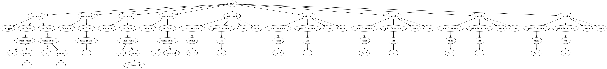

## 3 运算符

$cp$ 提供以下 $4$ 种类型的运算符：
- 算术运算符
- 比较运算符
- 赋值运算符
- 逻辑运算符
接下来，我将一一展示。

### 3.1 算术运算符

| 运算符 | 描述 |
| :------: | ---- |
|   +   | 加 - 两个对象相加 |
|  -  | 减 - 得到负数或是一个数减去另一个数 |
|  *   | 乘 - 两个数相乘或是返回一个被重复若干次的字符串 |
|  / | 除 - x除以y |
|  % | 取模 - 返回除法的余数 |
|  ** | 幂 - 返回x的y次幂 |
|  // | 取整除 - 返回商的整数部分（向下取整） |

```cp
int a = 8
int b = 2
print("a + b =", a+b)
print("a - b =", a-b)
print("a * b =", a*b)
print("a / b =", a/b)
print("a % b =", a%b)
print("a ** b =", a**b)
print("a // b =", a//b)
```

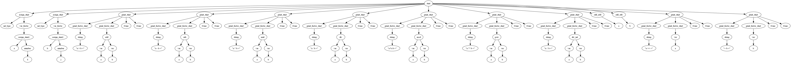


### 3.2 比较运算符

| 运算符 | 描述 |
| :------: | ---- |
|   ==   | 等于 - 比较对象是否相等 |
|  !=  | 不等于 - 比较两个对象是否不相等 |
|  >  | 大于 - 返回x是否大于y |
|  < | 小于 - 返回x是否小于y。所有比较运算符返回1表示真，返回0表示假。这分别与特殊的变量 True 和 False 等价。 |
|  >= | 大于等于 - 返回x是否大于等于y。 |
|  <= | 小于等于 - 返回x是否小于等于y。 |

```cp
print("1 == 2 =", 1==2)
print("1 != 2 =", 1!=2)
print("1 > 2 =", 1>2)
print("1 < 2 =", 1<2)
print("1 >= 2 =", 1>=2)
print("1 <= 2 =", 1<=2)
```


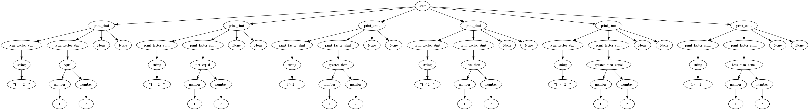

### 3.3 赋值运算符

| 运算符 | 描述 |
| :------: | ---- |
|=	 |简单的赋值运算符|
|+=	|加法赋值运算符|
|-=	|减法赋值运算符|
|*=	|乘法赋值运算符|
|/=	|除法赋值运算符|
|%=	|取模赋值运算符|
|**=	|幂赋值运算符|
|//=	|取整除赋值运算符|

```cp
int a = 1, b = 2
a += b
print("a += b =", a)
a -= b
print("a -= b =", a)
a *= b
print("a *= b =", a)
a /= b
print("a /= b =", a)
a %= b
print("a %= b =", a)
a **= b
print("a **= b =", a)
a //= b
print("a //= b =", a)
```

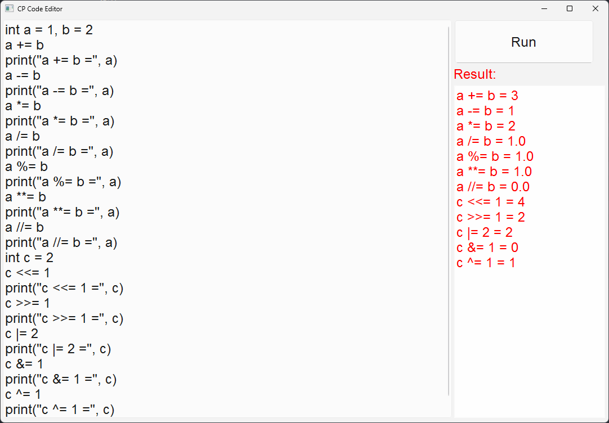


### 3.4 逻辑运算符

| 运算符 | 描述 |
| :------: | ---- |
|&	 |与|
|\|	|或|
|^	|异或|
|~	|取反|
|!  |非|
| >> | 右移 |
| << | 左移 |

```cp
print("1 & 3 =", 1 & 3)
print("1 | 2 =", 1 | 2)
print("1 ^ 3 =", 1 ^ 3)
print("~1 =", ~1)
print("!1 =", !1)
print("1 << 2 =", 1 << 2)
print("5 >> 2 =", 5 >> 2)
```

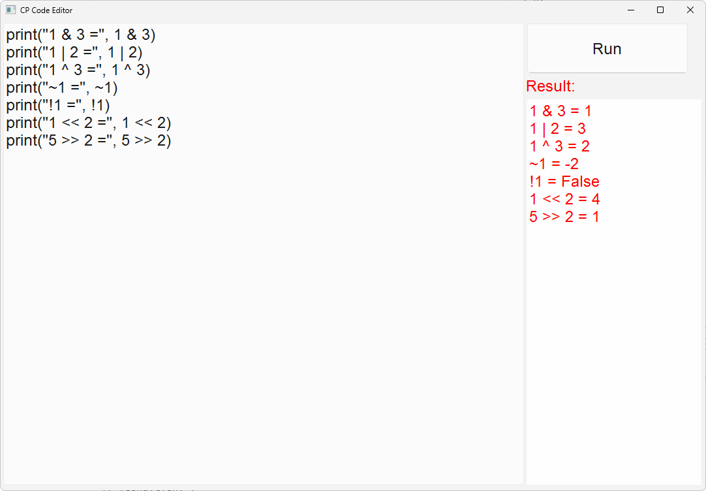


## 4 条件控制

条件控制语句格式为：

```cp
if (condition) {
  statement
}
[elif (condition) {
  statement
}]
[elif (condition) {
  statement
}]
[...]
[else {
  statement
}]
```

现有一例子如下：

```cp
int a = 10, b = 5
if(a < b) {
  print("a < b")
} elif(a == b) {
  print("a == b")
} else {
  print("a > b")
}
int c = 5, d = 5
if(c < d) {
  print("c < d")
} elif(c == d) {
  print("c == d")
} else {
  print("c > d")
}
int e = 5, f = 10
if(e < f) {
  print("e < f")
} elif(e == f) {
  print("e == f")
} else {
  print("e > f")
}
```

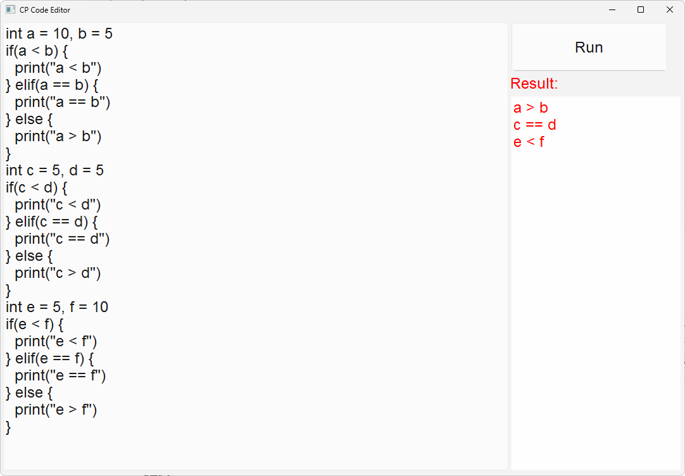

)

## 5 循环控制

### 5.1 for 循环

for 循环格式为：
```cp
for ([statement]; [condition]; [statement]) {
  statement
}
```

现有一例子如下：

```cp
for (int i = 0; i < 3; i++) {
  print("i =", i)
}

for (int j = 0; j < 3;) {
  print("j =", j)
  j ++
}

int k = 0

for (; k < 3;) {
  print("k =", k)
  k ++
}

```


### 5.2 while 循环
while 循环格式为：
```cp
while (condition) {
  statement
}
```

现有一例子如下：
```cp
int i = 0
while (i < 3) {
  print("i =", i)
  i ++
}
```


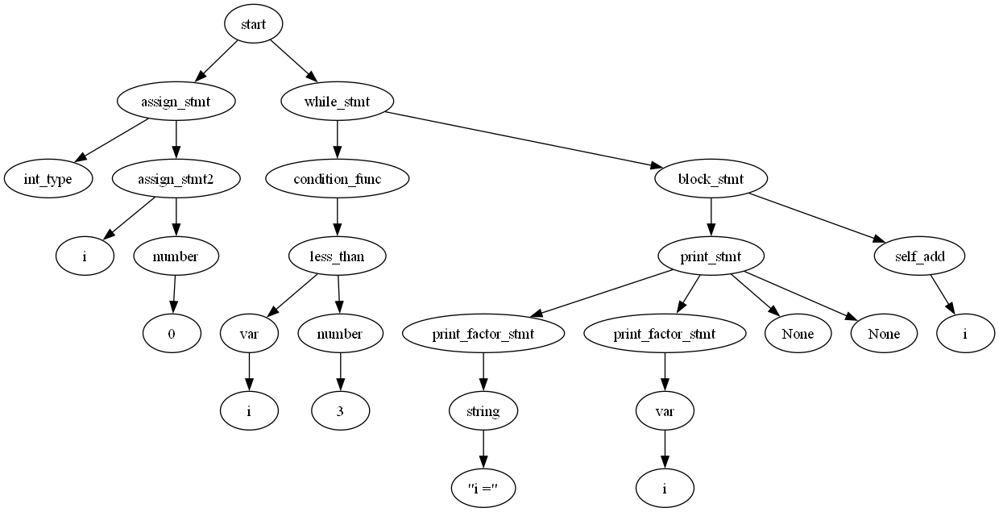

### 5.3 do-while 循环

do-while 循环格式为：
```cp
do {
  statement
} while (condition)
```

现有一例子如下：
```cp
int i = 0
do {
  print("i =", i)
  i ++
} while (i < 3)
```

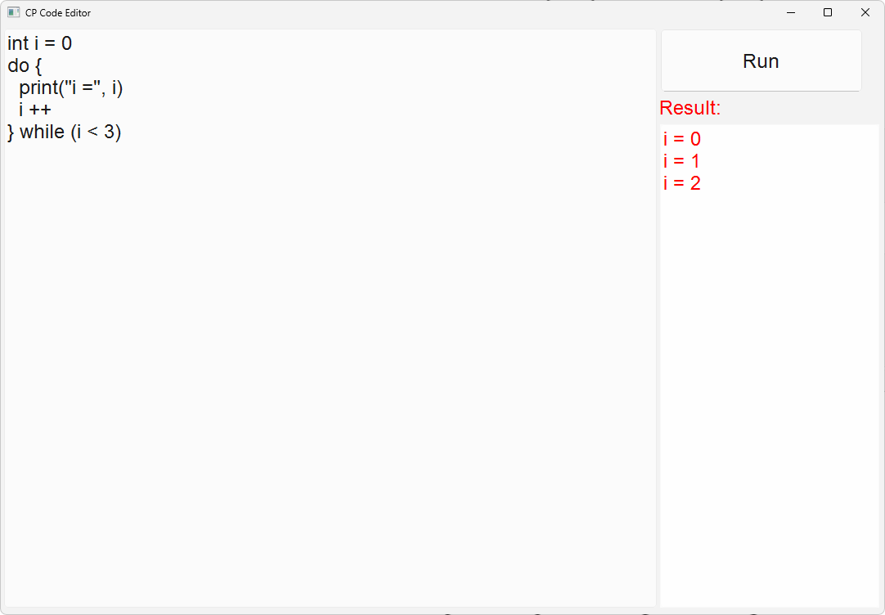

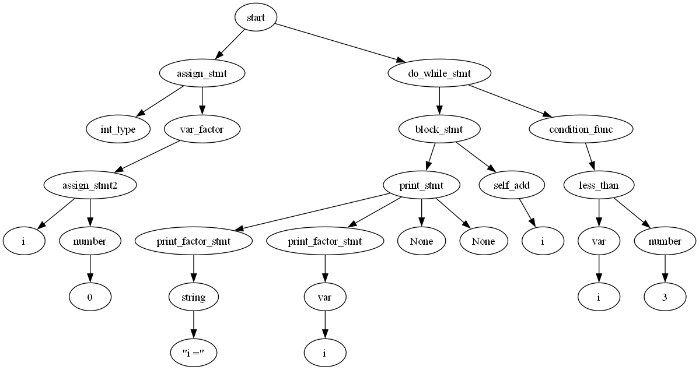

### 5.4 continue 语句

continue 语句格式为：

```cp
for(statement; condition; statement) {
  [statement]
  continue
  [statement]
}
```

现有一例子如下：

```cp
for(int i = 0; i < 3; i ++) {
  print("before continue")
  continue 
  print("after continue")
}
```

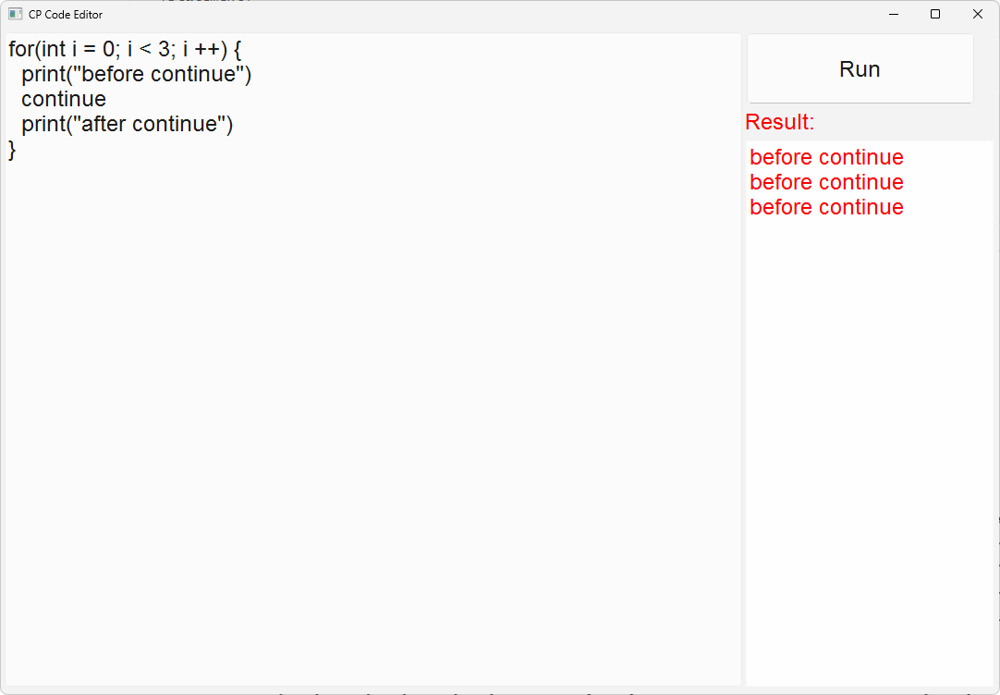


### 5.5 break 语句

break 语句格式为：
```cp
for(statement; condition; statement) {
  [statement]
  break
  [statement]
}
```

现有一例子如下：

```cp
for(int i = 0; ; i ++) {
  print(i)
  if(i == 3) {
    break
  }
}
```

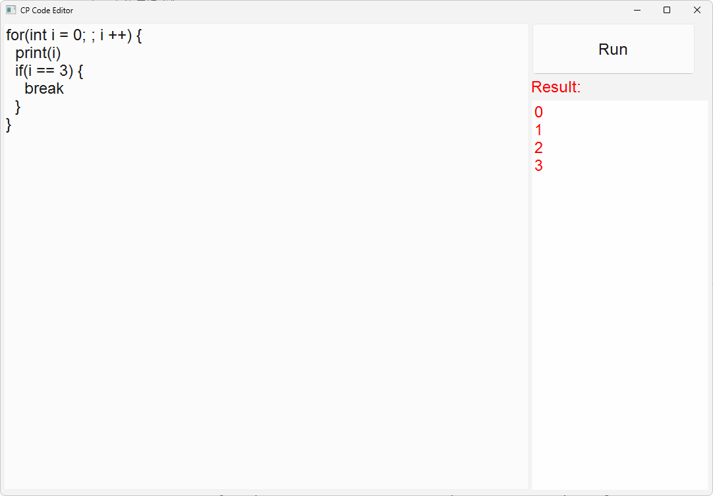


